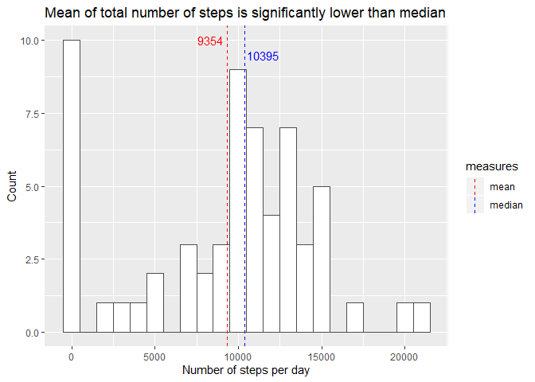
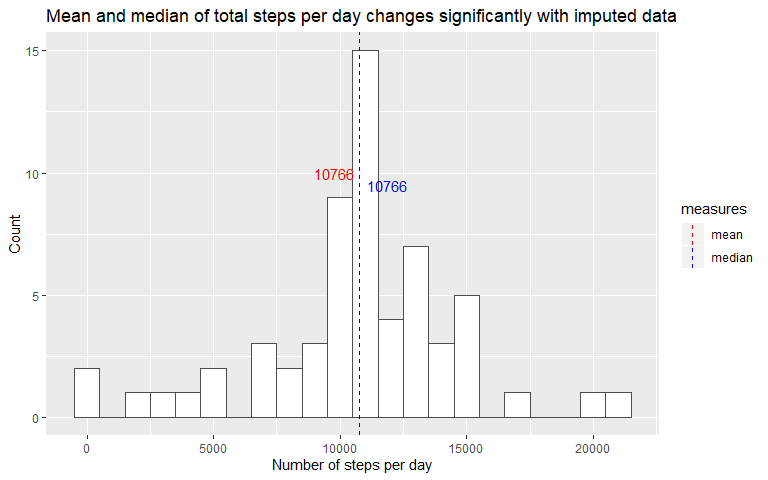
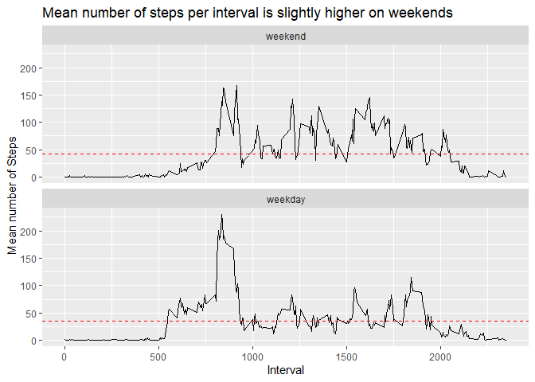

## Loading and preprocessing the data


```r
library(dplyr)

steps_data <- read.csv("./data/activity.csv")
steps_data <- group_by(steps_data, date)
```


## What is mean total number of steps taken per day?

```r
library(ggplot2)

total_steps <- steps_data %>% summarise(totalSteps = sum(steps, na.rm = TRUE))

g <- ggplot(total_steps, aes(x = totalSteps))
p <- g + geom_histogram(binwidth = 1000, color = "grey30", fill = "white") + 
     geom_vline(aes(xintercept = mean(totalSteps, na.rm = TRUE), color = "mean"), linetype = "dashed") + 
     geom_vline(aes(xintercept = median(totalSteps, na.rm = TRUE), color = "median"), linetype = "dashed") +
     labs(title = "Mean of total number of steps is significantly lower than median", x = "Number of steps per day", y = "Count") + 
     scale_colour_manual(name = "measures", values = c("mean" = "red", "median" = "blue"), labels = c("mean", "median")) +
     annotate("text", x = mean(total_steps$totalSteps, na.rm = TRUE) - 1000, y = 10, label = as.integer(mean(total_steps$totalSteps, na.rm = TRUE)), colour = "red") + 
     annotate("text", x = median(total_steps$totalSteps, na.rm = TRUE) + 1100, y = 9.5, label = as.integer(median(total_steps$totalSteps, na.rm = TRUE)), colour = "blue")

p
```

<!-- -->

## What is the average daily activity pattern?


```r
interval_data <- aggregate(steps ~ interval, data = steps_data, mean)
max_interval <- interval_data[which(interval_data$steps == max(interval_data$steps)), ]
g <- ggplot(data = interval_data, aes(interval, steps, label = interval))
p <- g + geom_line() + 
     geom_text(data = max_interval, label = as.integer(max_interval$steps), vjust = "inward", hjust = -0.5) +
     geom_vline(aes(xintercept = interval_data[which(interval_data$steps == max(interval_data$steps)), ]$interval), col = "red", linetype = "dashed") + 
     scale_x_continuous(breaks = c(0, 500, 1000, 1500, 2000, max_interval$interval)) + 
     labs(title = "Maximum nr of steps per interval occurs in the morning", x = "Interval", y = "Mean number of Steps")
p
```

<!-- -->


## Imputing missing values
There are 2304 missing values in the dataset.

These missing values can be imputed from the mean for the 5 minute interval across all days:

```r
steps_data <- steps_data %>% 
              group_by(interval) %>% 
              mutate(intervalMean = mean(steps, na.rm = TRUE))
steps_data[is.na(steps_data$steps), ]$steps <- steps_data[is.na(steps_data$steps), ]$intervalMean
steps_data <- steps_data %>% 
              select(-intervalMean) %>%
              group_by(date)

total_steps <- steps_data %>% 
               summarise(totalSteps = sum(steps, na.rm = TRUE))
```

The resulting histogram shows a significant change in both the mean and the median as a result of the imputation. The mean and median are now equal.

```r
g <- ggplot(total_steps, aes(x = totalSteps))
p <- g + geom_histogram(binwidth = 1000, color = "grey30", fill = "white") + 
     geom_vline(aes(xintercept = mean(totalSteps, na.rm = TRUE), color = "mean"), linetype = "dashed") + 
     geom_vline(aes(xintercept = median(totalSteps, na.rm = TRUE), color = "median"), linetype = "dashed") +
     labs(title = "Mean and median of total steps per day changes significantly with imputed data", x = "Number of steps per day", y = "Count") + 
     scale_colour_manual(name = "measures", values = c("mean" = "red", "median" = "blue"), labels = c("mean", "median")) +
     annotate("text", x = mean(total_steps$totalSteps, na.rm = TRUE) - 1000, y = 10, label = as.integer(mean(total_steps$totalSteps, na.rm = TRUE)), colour = "red") + 
     annotate("text", x = median(total_steps$totalSteps, na.rm = TRUE) + 1100, y = 9.5, label = as.integer(median(total_steps$totalSteps, na.rm = TRUE)), colour = "blue")

p
```

<!-- -->


## Are there differences in activity patterns between weekdays and weekends?

```r
steps_data <- ungroup(steps_data)

steps_data$dayType <- factor(grepl("S(at|un)", 
                             weekdays(as.Date(steps_data$date), abbr = TRUE)), 
                             levels = c(TRUE, FALSE), 
                             labels = c("weekend", "weekday"))

mean_steps <- steps_data %>%
              group_by(dayType, interval) %>%
              summarise(meanSteps = mean(steps, na.rm = TRUE))

mean_steps <- group_by(mean_steps, dayType)
daymeans <- summarise(mean_steps, avg = mean(meanSteps))

#qplot(interval, meanSteps, data = mean_steps, facets = . ~ dayType, geom = "line")
g <- ggplot(mean_steps, aes(interval, meanSteps))
p <- g + geom_line() + 
     geom_hline(data = daymeans, aes(yintercept = avg), colour = "red", linetype = "dashed") +
     facet_wrap(. ~ dayType, ncol = 1) + 
     labs(title = "Mean number of steps per interval is slightly higher on weekends", x = "Interval", y = "Mean number of Steps")
p
```

<!-- -->
